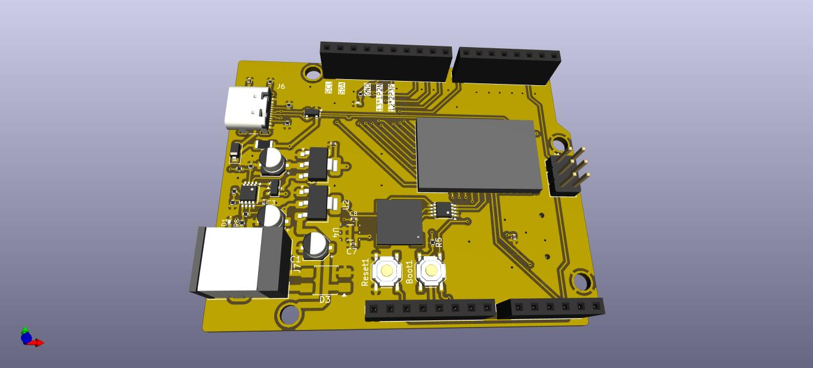
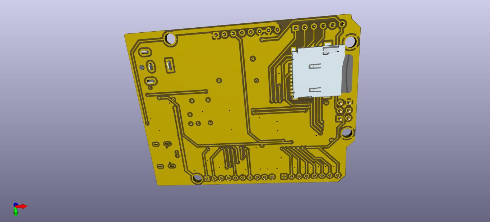

\# Arduino Uno Compatible Board Based on Qualcomm QCC748 SOM

 

 

This is a custom Arduino Uno-compatible board built around the Qualcomm QCC748 System-on-Module (SOM). This repository contains the full schematic, PCB layout, and supporting documentation for the board design.

## 🔧 Overview

This project implements an Arduino Uno form-factor development board using the Qualcomm QCC748 SOM as the core processing module. The design maintains compatibility with the Arduino Uno pinout while leveraging the QCC748's capabilities for enhanced wireless connectivity and processing performance. In addition, the board includes a speaker, microphone, and MicroSD card interface.

## Key Goals

\- ✅ Arduino Uno R3 mechanical footprint compatibility

\- ✅ Standard Arduino header pinout

\- ✅ USB programming interface

\- ✅ Power supply regulation (5V / 3.3V)

\- ✅ Wireless connectivity via QCC748 integrated Wifi and Bluetooth

